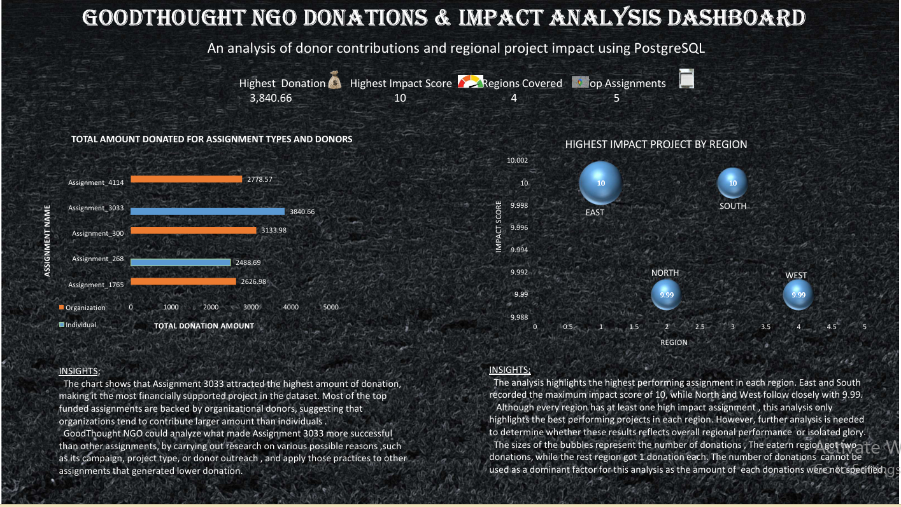

# 💙 GoodThought NGO: Donation & Impact Analysis
An end-to-end data analytics project using **PostgreSQL** and **Microsoft Excel** to analyze donation patterns, donor behavior, and project impact across different regions for GoodThought NGO.
> **Data Source:** This project uses the GoodThought NGO dataset from DataCamp's Data Analyst track. The SQL analysis, dashboard, and business insights are entirely my own work.
---
## 📊 Dashboard Preview

---
## 📌 Project Overview
This project explores how donations are distributed across assignments, donor types, and regions while evaluating whether funding aligns with project impact.
The analysis transforms raw NGO data into actionable insights that can support fundraising strategies and resource allocation decisions.
---
## 🎯 Project Objectives
This project answers two key business questions:
1. Which assignments receive the highest funding, and which donor types contribute the most?
2. Do regions with the highest-impact projects receive proportional donor support?
---
## 🛠 Tech Stack
### PostgreSQL
- Data Extraction
- Data Cleaning
- Data Aggregation
- SQL Analysis
### Microsoft Excel
- KPI Dashboard
- Charts & Visualizations
- Interactive Reporting
### GitHub
- Version Control
- Project Documentation
---
## 📈 Key Insights
- **Assignment_3033** received the highest single donation (**$3,840.66**), funded by **individual donors**.
- Every region recorded at least one assignment with an impact score close to **10/10**, indicating consistently high project quality.
- **Organizational donors** contributed higher average donation amounts per assignment than individual donors, making them the primary source of larger contributions.
---
## 📊 Dashboard Features
- Total Donations (KPI)
- Total Assignments (KPI)
- Average Impact Score (KPI)
- Highest Donation (KPI)
- Highest Donation by Assignment
- Average Donation by Donor Type
- Top Impact Score by Region
- Regional Donation Distribution
---
## 📂 Project Structure
```text
GoodThought-NGO-Donation-Analysis/
│
├── sql/
│   └── goodthought_analysis.sql
│
├── result/
│   ├── query1_donations.csv
│   └── query2_highest_regional_impact.csv
│
├── images/
│   └── dashboard_screenshot.png
│
└── README.md
```
---
## 📜 SQL Queries & Results
### Query 1: Top 5 Assignments by Total Donation Amount, Split by Donor Type
**SQL Script**
➡️ **[goodthought_analysis.sql](./sql/goodthought_analysis.sql#L1-L13)**
**Query Output**
➡️ **[query1_donations.csv](./result/query1_donations.csv)
---
### Query 2: Highest Impact Assignment per Region
**SQL Script**
➡️ **[goodthought_analysis.sql](./sql/goodthought_analysis.sql#L15-L29)**
**Query Output**
➡️ **[query2_highest_regional_impact.csv](./result/query2_highest_regional_impact.csv)
---
## 📚 Skills Demonstrated
- SQL Data Analysis
- Data Cleaning
- Data Aggregation
- GROUP BY & Aggregate Functions
- JOIN Operations
- Business Insight Generation
- Dashboard Design
- Data Visualization
- KPI Reporting
---
## 👤 Author
**Stephen Ugwueze**
Aspiring Data Analyst passionate about SQL, Excel, Power BI, and transforming raw data into meaningful insights.